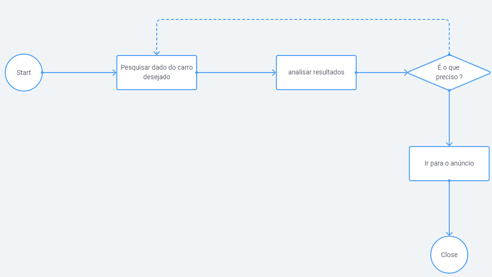
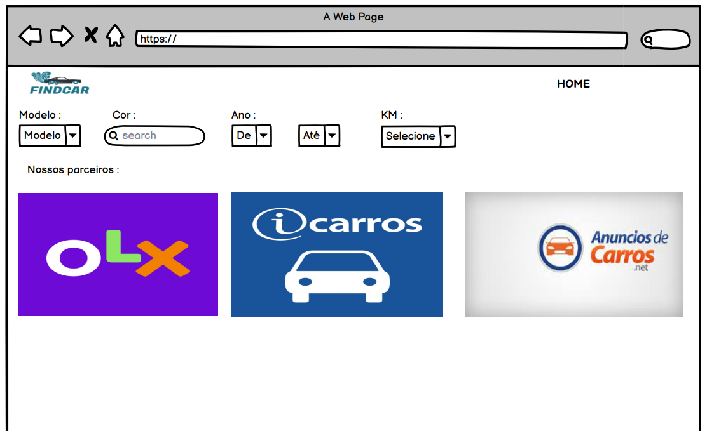
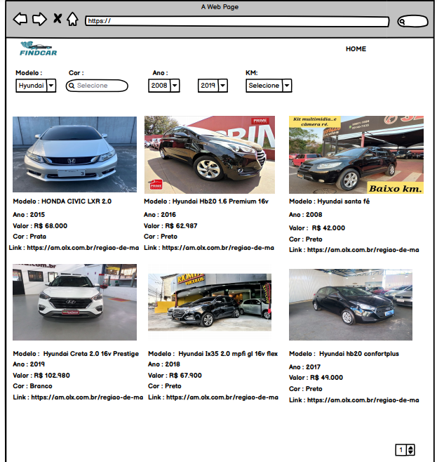

# Projeto de Interface

O usuário, ao acessar o FindCar irá para a tela inicial. Como apresentada no WireFrame, é uma tela simples com alguns campos de filtros para fazer a busca seguido de uma listagem de nossos parceiros.

O usuário insere os dados iniciais para buscar o anuncio desejado, como por exemplo, modelo que procura, e depois clica no botão “Buscar”. Após esses poucos cliques é apresentado uma lista de anúncios na tela com imagens e as informações mais relevantes de cada anuncio destacada, como por exemplo o preço, modelo e ano. 

O usuário navega pela página procurando um anúncio que seja de seu interesse e caso encontre, ao selecionar será direcionado para o site do anúncio original. Caso não encontre, ele pode fazer uma nova busca detalhando mais nos filtros.

## User Flow

## Wireframes

